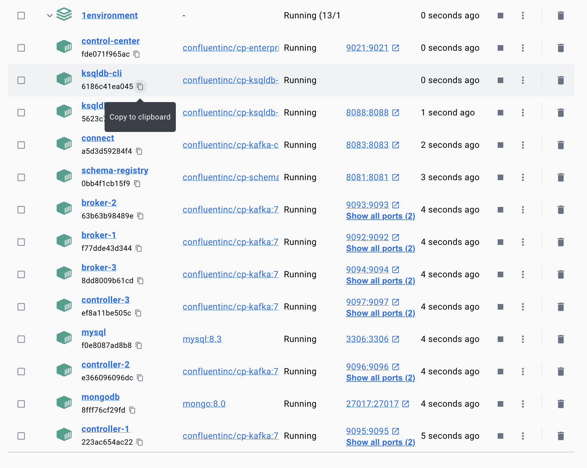
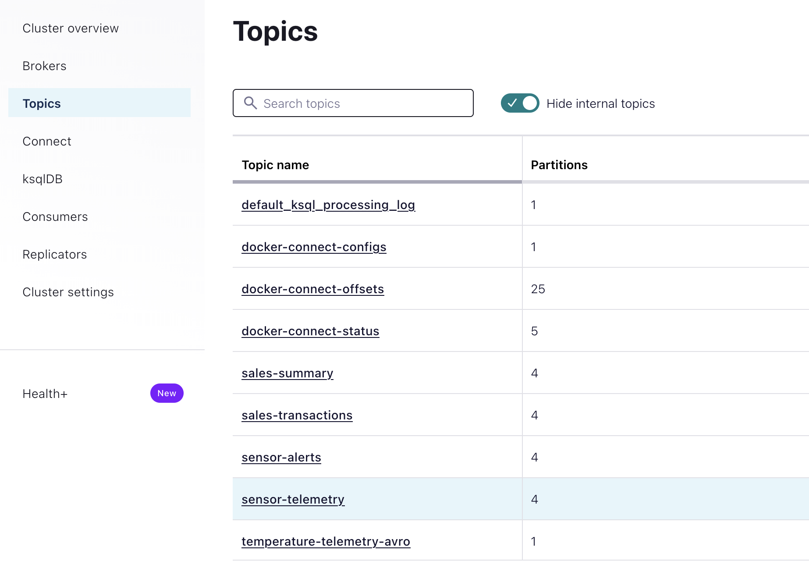

# Procesamiento de datos en tiempo real con kafka

**Autora**: Ivonne Yanez Mendoza **Email**: [ivonne\@imendoza.io](mailto:ivonne@imendoza.io){.email} **GitHub**: <https://github.com/TiaIvonne>


## Tabla de Contenidos

1.  [Descripción](#descripción)
2.  [Estructura del Directorio](#estructura-del-directorio)
3.  [Desarrollo del Proyecto](#desarrollo-del-proyecto)
4.  [Soporte](#soporte)
5.  [Licencia](#licencia)

## Descripción 

Este proyecto corresponde al modulo de Kafka y Procesamiento de datos en tiempo real del Master en Ingenieria de datos de la Universidad Complutense de Madrid.

Se debe construir una solución basada en Apache Kafka que permita:

1.  Procesar los datos de sensores agrícolas en tiempo real para detectar condiciones anormales (picos de temperatura & humedad)

2.  Integrar los datos de transacciones de ventas provenientes de una base de datos relacional MySql utilizando Kafka Connect.

3.  Transformar los datos mediante procesamiento streaming para generar insights del tipo: alertas de anomalías en los sensores y ventas por categoría de producto cada minuto.

## Estructura del directorio 

     0.tarea/
      ├── assets/
      ├── connectors/
      ├── datagen/
      ├── sql/
      ├── src/
      ├── pom.xml
      ├── setup.sh
      ├── shutdown.sh
      └── start_connectors.sh

Los directorios mas relevantes para esta practica son:

**connectors**: Contienen los conectores generados en formato JSON los cuales son necesarios para generar datos sintéticos, integrarlos con MySql, procesar los datos en tiempo real de los sensores e integrar con una base de datos no SQL.\
**datagen**: Contienen la definicion del esquema y del tipo de dato a utilizar en los connectores.\
**sql**: Contiene la definicion de la tabla sales_transaccions que debe ser procesada en MySql\
**src**: La fuente del proyecto y donde se encuentra el codigo base para procesar los datos en tiempo real de farmaia.

Fuera de la estructura del directorio se encuentran tres scripts que se deben ejecutar en la shell que realizan las siguientes acciones:\
**setup.sh:** Contiene todo lo necesario para levantar Docker y evitar tener que configurar el archivo yml en el directorio.\
**shutdown.sh:** Para detener entorno.\
**start_connectors.sh:** Lanza los connectores en lote en vez de ejecutar cada comando por separado.

## Desarrollo del proyecto 

### Crear los topics

Se pide la creación de los siguientes topics (contenedor de mensajes)

1.  sensor-telemetry: Contiene datos de los sensores agrícolas.

2.  sales-transactions: Contiene datos de transacciones de ventas.

3.  sensor-alerts: Contiene alertas generadas (picos de temperatura y humedad) generadas al procesar los mensajes.

4.  sales-summary: Contiene el resumen de ventas (con agregaciones) generadas al procesar los datos.

Para crear los conectores es necesario comenzar lanzando el script setup.sh que es el encargado de crear el entorno basado en docker el cual construirá el entorno de trabajo para esta practica:

``` bash
 0.tarea git:(master) ✗ ./setup.sh
  ✔ Container connect  Started 5.6s 
Esperando reinicio contenedor connect
OK
```



Una vez que esta corriendo docker es momento de entrar en la consola interactiva y crear los topics

```shell-session
0.tarea git:(master) ✗ docker exec -it broker-1 /bin/bash
```
Una vez en la consola se lanzan los siguientes comandos para crear los topicos:

```bash
[appuser@broker-1 ~]$ kafka-topics --bootstrap-server broker-1:29092 --create --topic sensor-telemetry --partitions 4 --replication-factor 2 --config max.message.bytes=64000 --config flush.messages=1
```
Nota personal: Esto puede ser un poco tedioso por cada topic, por lo que he creado un script de bash que hace esta tarea por cada topic a crear.  
El script se encuentra en el directorio raiz con el nombre de **create-topics.sh**.  

```bash
BOOTSTRAP_SERVER="broker-1:29092"
  PARTITIONS=4
  REPLICATION_FACTOR=2

TOPICS=(
      "sensor-telemetry"
      "sales-transactions"
      "sensor-alerts"
      "sales-summary"
)

for TOPIC in "${TOPICS[@]}"; do
    echo "Creando topic: $TOPIC"
    docker exec broker-1 kafka-topics \
        --bootstrap-server $BOOTSTRAP_SERVER \
        --create \
        --topic $TOPIC \
        --partitions $PARTITIONS \
        --replication-factor $REPLICATION_FACTOR \
        --config max.message.bytes=64000 \
        --config flush.messages=1
    done
```

Por consola se pueden ver los topics creados

```bash
kafka-topics --bootstrap-server broker-1:29092 --list
```
O en el control center:  




## Licencia 

Todos los derechos reservados
