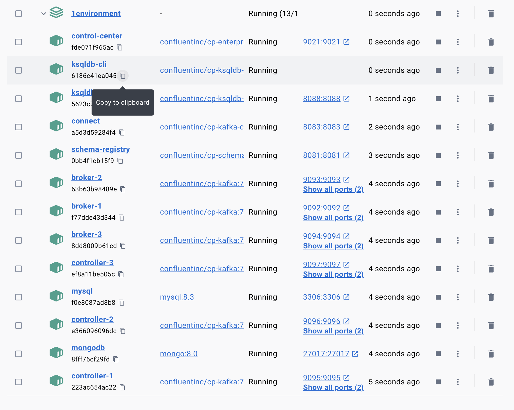
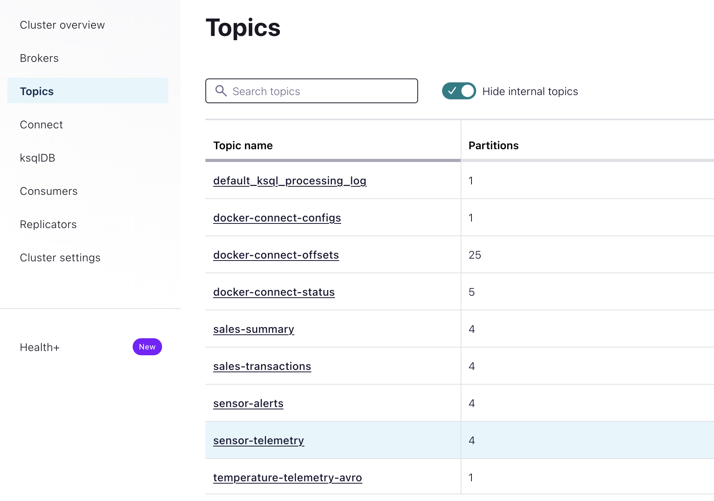
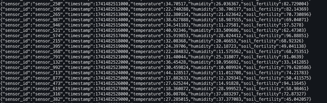
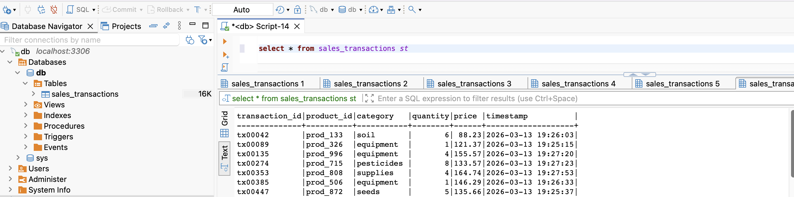
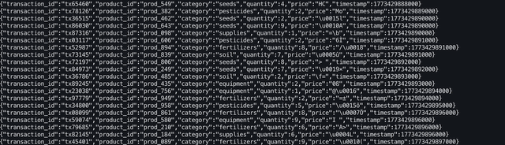

---
output:
  html_document: default
  pdf_document: default
---

# Procesamiento de datos en tiempo real con kafka

**Autora**: Ivonne Yanez Mendoza **Email**: [ivonne\@imendoza.io](mailto:ivonne@imendoza.io) **GitHub**: <https://github.com/TiaIvonne>

  

## Tabla de Contenidos

1.  [Descripción](#descripción)
2.  [Estructura del Directorio](#estructura-del-directorio)
3.  [Desarrollo del Proyecto](#desarrollo-del-proyecto)
4.  [Soporte](#soporte)
5.  [Licencia](#licencia)

## Descripción {#descripción}

Este proyecto corresponde al modulo de Kafka y Procesamiento de datos en tiempo real del Master en Ingeniería de datos de la Universidad Complutense de Madrid.

Se debe construir una solución basada en Apache Kafka que permita:

1.  Procesar los datos de sensores agrícolas en tiempo real para detectar condiciones anormales (picos de temperatura & humedad)

2.  Integrar los datos de transacciones de ventas provenientes de una base de datos relacional MySql utilizando Kafka Connect.

3.  Utilizar un conector que genera datos de prueba (Kafka connect datagen) para simular un escenario de procesamiento de datos.

4.  Transformar los datos mediante procesamiento streaming para generar insights del tipo: alertas de anomalías en los sensores y ventas por categoría de producto cada minuto.

## Estructura del directorio {#estructura-del-directorio}

     0.tarea/
      ├── assets/
      ├── connectors/
      ├── datagen/
      ├── sql/
      ├── src/
      ├── pom.xml
      ├── setup.sh
      ├── shutdown.sh
      └── start_connectors.sh

Los directorios mas relevantes para esta practica son:

**connectors**: Contienen los conectores generados en formato JSON los cuales son necesarios para generar datos sintéticos, integrarlos con MySql, procesar los datos en tiempo real de los sensores e integrar con una base de datos no SQL.\
**datagen**: Contienen la definicion del esquema y del tipo de dato a utilizar en los connectores.\
**sql**: Contiene la definicion de la tabla sales_transaccions que debe ser procesada en MySql\
**src**: La fuente del proyecto y donde se encuentra el codigo base para procesar los datos en tiempo real de farmaia.

Fuera de la estructura del directorio se encuentran tres scripts que se deben ejecutar en la shell que realizan las siguientes acciones:\
**setup.sh:** Contiene todo lo necesario para levantar Docker y evitar tener que configurar el archivo yml en el directorio.\
**shutdown.sh:** Para detener entorno.\
**start_connectors.sh:** Lanza los connectores en lote en vez de ejecutar cada comando por separado.

## Desarrollo del proyecto {#desarrollo-del-proyecto}

### 1. Crear los topics

Se pide la creación de los siguientes topics (contenedor de mensajes)

1.  sensor-telemetry: Contiene datos de los sensores agrícolas.

2.  sales-transactions: Contiene datos de transacciones de ventas.

3.  sensor-alerts: Contiene alertas generadas (picos de temperatura y humedad) generadas al procesar los mensajes.

4.  sales-summary: Contiene el resumen de ventas (con agregaciones) generadas al procesar los datos.

Para crear los conectores es necesario comenzar lanzando el script setup.sh que es el encargado de crear el entorno basado en docker el cual construirá el entorno de trabajo para esta practica:

``` bash
 0.tarea git:(master) ✗ ./setup.sh
  ✔ Container connect  Started 5.6s 
Esperando reinicio contenedor connect
OK
```



Una vez que esta corriendo docker es momento de entrar en la consola interactiva y crear los topics

``` shell-session
0.tarea git:(master) ✗ docker exec -it broker-1 /bin/bash
```

Una vez en la consola se lanzan los siguientes comandos para crear los topicos:

``` bash
[appuser@broker-1 ~]$ kafka-topics --bootstrap-server broker-1:29092 --create --topic sensor-telemetry --partitions 4 --replication-factor 2 --config max.message.bytes=64000 --config flush.messages=1
```

Nota personal: Esto puede ser un poco tedioso por cada topic, por lo que he creado un script de bash que hace esta tarea por cada topic a crear.\
El script se encuentra en el directorio raiz con el nombre de **create-topics.sh**.

``` bash
BOOTSTRAP_SERVER="broker-1:29092"
  PARTITIONS=4
  REPLICATION_FACTOR=2

TOPICS=(
      "sensor-telemetry"
      "sales-transactions"
      "sensor-alerts"
      "sales-summary"
)

for TOPIC in "${TOPICS[@]}"; do
    echo "Creando topic: $TOPIC"
    docker exec broker-1 kafka-topics \
        --bootstrap-server $BOOTSTRAP_SERVER \
        --create \
        --topic $TOPIC \
        --partitions $PARTITIONS \
        --replication-factor $REPLICATION_FACTOR \
        --config max.message.bytes=64000 \
        --config flush.messages=1
    done
```

Por consola se pueden ver los topics creados

``` bash
kafka-topics --bootstrap-server broker-1:29092 --list
```

O en el control center:



### 2. Datasets de entrada

Una vez creados los topics, es momento de prestar atención a la estructura o esquema que tendrán los datos a ser procesados. Los datos de transacciones de ventas ya vienen configurado por defecto con este repositorio, se debe crear la estructura de los sentores agricolas.

Para esto se debe completar el archivo sensor-telemetry.avsc con los campos requeridos en la practica:

-   sensor_id: string

-   timestamp: long pero con una iteracion que parte con una fecha razonable para generar datos.

-   temperature: float con un rango entre 15 y 45 grados máximo

-   humidity: float con rango minimo de 10 y máximo 40

-   soil_fertility: float con rango minimo de 30 y máximo 100

``` json
{
  "namespace": "com.farmia.iot",
  "name": "SensorTelemetry",
  "type": "record",
  "fields": [
    {
      "name": "sensor_id",
      "type": {
        "type": "string",
        "arg.properties": {
          "regex": "sensor_[0-9]{3}"
        }
      }
    },
    {
      "name": "timestamp",
      "type": {
        "type": "long",
        "arg.properties": {
          "iteration": {
            "start": 1741478400000,
            "step": 1000
          }
        }
      }
    },
```

### 3. Tareas a resolver

#### 1. Generacion de datos sinteticos con Kafka Connect

Este conector simula las lecturas de los sensores de datos y envia hacia el topic sensor-telemetry.
Una vez creado el esquema en el punto anterior se pueden configurar los conectores necesarios para procesar transacciones.
En la practica se incluye un script de bash que lanza todos los conectores de una vez, tambien se pueden lanzar por separado.


```json
{
  "name": "source-datagen-sensor-telemetry",
  "config": {
    "connector.class": "io.confluent.kafka.connect.datagen.DatagenConnector",
    "kafka.topic": "sensor-telemetry",
    "schema.filename": "/home/appuser/sensor-telemetry.avsc",
    "schema.keyfield": "sensor_id",
    "max.interval": 500,
    "iterations": 10000000,
    "tasks.max": "1"
  }
}
```
Con este comando se registra el conector:
```bash
  curl -d @"./connectors/source-datagen-sensor-telemetry.json" \
    -H "Content-Type: application/json" \
    -X POST http://localhost:8083/connectors | jq
        -H "Content-Type: application/json" \
    -X POST http://localhost:8083/connectors | jq
  % Total    % Received % Xferd  Average Speed   Time    Time     Time  Current
                                 Dload  Upload   Total   Spent    Left  Speed
100   717  100   373  100   344   3693   3406 --:--:-- --:--:-- --:--:--  7170
{
  "name": "source-datagen-sensor-telemetry",
  "config": {
    "connector.class": "io.confluent.kafka.connect.datagen.DatagenConnector",
    "kafka.topic": "sensor-telemetry",
    "schema.filename": "/home/appuser/sensor-telemetry.avsc",
    "schema.keyfield": "sensor_id",
    "max.interval": "500",
    "iterations": "10000000",
    "tasks.max": "1",
    "name": "source-datagen-sensor-telemetry"
  },
  "tasks": [],
  "type": "source"
}

```
Se puede comprobar en el control center la creacion de los mensajes y tambien en la shell utilizando
este comando:

```bash
  docker exec -it schema-registry kafka-avro-console-consumer \
    --bootstrap-server broker-1:29092 \
    --topic sensor-telemetry
```



#### 2. Integracion de MySql con Kafka connect

Se debe configurar un conector que lea datos desde una base de datos en MySql que contiene las transacciones de ventas
Esta tabla es la tabla transactions que ademas esta configurada en el proyecto.

Este topic es algo distinto al anterior pues para funcionar correctamente se deben lanzar dos conectores internos que generan datos en datagen source-datagen-_transactions y sink-mysql-_transactions. 

Una vez lanzados se puede observar los datos que estan guardandose en sales_transactions en my sql.
En este caso se ha utilizado DBeaver para mostrar los resultados:




Con estas preparaciones previas y configurado el conector source-mysql-sales_transactions.json se puede lanzar el comando:

```bash
curl -d @"./connectors/source-mysql-sales_transactions.json" -H "Content-Type: application/json" -X POST http://localhost:8083/connectors | jq
  % Total    % Received % Xferd  Average Speed   Time    Time     Time  Current
                                 Dload  Upload   Total   Spent    Left  Speed
100  1611  100   798  100   813   2426   2471 --:--:-- --:--:-- --:--:--  4911
{
  "name": "source-mysql-sales_transactions",
  "config": {
    "connector.class": "io.confluent.connect.jdbc.JdbcSourceConnector",
    "connection.url": "jdbc:mysql://mysql:3306/db?useSSL=false&allowPublicKeyRetrieval=true",
    "connection.user": "user",
    "connection.password": "password",
    "table.whitelist": "db.sales_transactions",
    "mode": "timestamp",
    "timestamp.column.name": "timestamp",
    "poll.interval.ms": "1000",
    "tasks.max": "1",
    "transforms": "renametopic,setkey",
    "transforms.renametopic.type": "org.apache.kafka.connect.transforms.RegexRouter",
    "transforms.renametopic.regex": ".*",
    "transforms.renametopic.replacement": "sales-transactions",
    "transforms.setkey.type": "org.apache.kafka.connect.transforms.ValueToKey", y 
    "transforms.setkey.fields": "transaction_id",
    "name": "source-mysql-sales_transactions"
  },
  "tasks": [],
  "type": "source"
}
```

Se pueden ver los resultados en el control center o directamente en la terminal con este comando

```bash
 docker exec -it schema-registry kafka-avro-console-consumer \
    --bootstrap-server broker-1:29092 \
    --topic sales-transactions 2>/dev/null
```



En el control center se puede revisar un mensaje con mas detalle:

```json
{
  "transaction_id": "tx52977",
  "product_id": "prod_536",
  "category": "equipment",
  "quantity": 4,
  "price": "\u0011r",
  "timestamp": 1773430169000
}
```


#### 3. Procesamiento en tiempo real de sensores
## Licencia {#licencia}

Todos los derechos reservados
